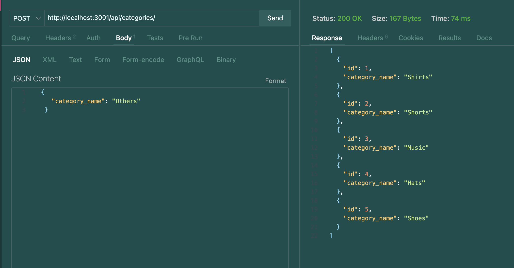

# shopMINTY

## Description 📰

The shopMINTY application allows for the user to get, create, update, and delete data from our retail database. This was made for the purpose of allowing a dynamic database. This was made using Sequelize, MYSQL, and express.js.  

My motivation for this app was the fact that up until this point, we were manually updating databases in our code on the back-end. But now, I built this project as a means to eventually allow the user to dynamically update our database as well.  

This application solves the problem of ecommerce sites' organizing of their data. If the client were to add something on the front end, they could add a whole new category or product to the database and have relative information also dynamically change alongside. This app's particular code solves the problem of complex MYSQL logic; using Sequelize allows for a more streamlined code infrastructure to manage our database.  

In building this app, I learned a whole new syntax (pertaining to the Sequelize module) that allows us to interact with the database in a more streamlined, quicker manner. I am also learning new organization as it relates to files and folders and how they relate to each other, particularly with Sequelize's through and include attributes.  

## Table of Contents

&nbsp;&nbsp;&nbsp;&nbsp;&nbsp;&nbsp; ➣ [Installation](#Installation)

&nbsp;&nbsp;&nbsp;&nbsp;&nbsp;&nbsp; ➣ [Usage](#Usage)

&nbsp;&nbsp;&nbsp;&nbsp;&nbsp;&nbsp; ➣ [Contributing](#Contributing)

&nbsp;&nbsp;&nbsp;&nbsp;&nbsp;&nbsp; ➣ [Tests](#Tests)

&nbsp;&nbsp;&nbsp;&nbsp;&nbsp;&nbsp; ➣ [Credits](#Credits)

&nbsp;&nbsp;&nbsp;&nbsp;&nbsp;&nbsp; ➣ [Questions](#Questions)

## Installation 🔌

In order to install, please run `npm i`.

## Usage 🧮

In order to use this app, please run `npm start` after you have sourced the database and run the seeds.

Then, the client can make a `GET`, `POST`, `PUT`, or `DELETE` request and update the database.

  

Please refer to [the shopMINTY walkthrough video](https://watch.screencastify.com/v/kTCR5ZiSJ3yoQO9S5JAW) for more information on how to use this app.

## Contributing 🍴

In order to contribute, one must fork their repository and create a pull request.

## Tests ⚖️

N/A

 ## Credits 🤝
  edX: starter code

## Questions 📭

Please enjoy my work at my GitHub, @[mintyry](https://github.com/mintyry).
For any questions, please refer to my email on my profile.

